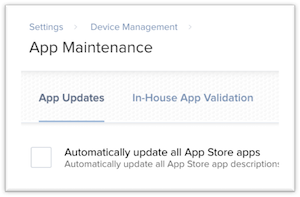

## iOS Application Update Scheduler Version 1.0 for Jamf|PRO

Welcome to the iOS Application Update Scheduler Page! This is a Java application that uses the Jamf PRO Classic API to divide up iOS application updates over a selected period of time. This will help spread the load on a Jamf PRO server that is put on by applications all trying to update at once. 

Requirements:

 1. Java SE Development Kit 8: [MacOS Java Download Page](http://www.oracle.com/technetwork/java/javase/downloads/jdk8-downloads-2133151.html)
 2. Global iOS App updates turned off in JamfPro and turned on for all the apps we want to have auto-updates turned on for. If we want to turn on app updates for all apps in the individual level feel free to run the [Setup Script](Resources/AppUpdateSetup.sh)
 
 This is the global setting we need disabled to turn on and schedule updates at the individual app level.
 
 This setting is not accessible via the API:
 
 
 
***If this it the first time setup it is recommended to use the Bash [Setup Script.](Resources/AppUpdateSetup.sh) This setup script has the option to download the .pkg when it is run and checks all the apps to make sure app updates are turned on at the individual level.***
 
To run the program please download the .pkg and run the installer or run the setup script. It will get installed to the Applications folder and can be run from there.

[MacOS Download](App-Update-Scheduler.pkg)

Happy Scheduling! 

If we would like to turn off app updates for all iOS apps this script here will do the trick: [Turn OFF Updates Script](Resources/AppUpdateOff.sh)

_______________________________________________________________________________________________________________________

FUTURE PLANS: Add support for MacOS apps (then it will just be the App Update Scheduler page), integrate the functions of the scripts into the app, add the ability to turn on and off from .csv and a script to get the apps that are affected by PI-003112. Also, interface updates! 

Any ideas or suggestions are welcomed! 

Source code can be found on [Bryan's Page](https://github.com/blarson007/app-update-scheduler) and [Zach's Page](https://github.com/zdorow/app-update-scheduler) and also in the Resources folder of this Repo.

[MIT license](https://github.com/zdorow/iOS-App-Update-Scheduler/blob/master/Resources/LICENSE)
